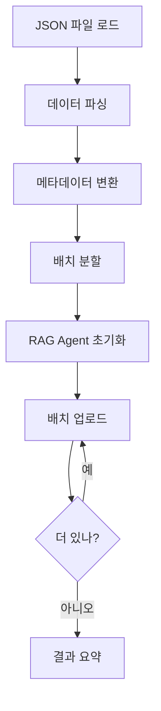

# JSON 형식 판례/행정해석 데이터 임포트 가이드

## 📋 개요

이 가이드는 JSON 형식으로 크롤링한 노동 판례 및 행정해석 데이터를 RAG 시스템에 임포트하는 방법을 설명합니다.

## 📁 데이터 구조

### JSON 파일 형식

```json
[
  {
    "cs_id": "43303",
    "title": "사건번호 : 대법2023추5122\n노동조합 및 노동관계조정법 제81조제1항 제4호...",
    "sub_category": "대법판례",
    "main_category": "전체사례",
    "date": "2026-01-08",
    "views": "3,961",
    "recommend": "+1,120",
    "page": 1,
    "content": "전체 판례 내용...",
    "content_length": 12152
  },
  ...
]
```

### 필드 설명

- **cs_id**: 케이스 고유 ID
- **title**: 제목 (사건번호/회시번호 포함)
- **sub_category**: 하위 카테고리 (대법판례, 고법판례, 지법판례, 행정해석)
- **main_category**: 주 카테고리
- **date**: 날짜 (YYYY-MM-DD)
- **views**: 조회수
- **recommend**: 추천수
- **content**: 전체 내용 (HTML 포함)
- **content_length**: 내용 길이

## 🚀 빠른 시작

### 1. 환경 설정 확인

`.env` 파일에 API 키가 설정되어 있는지 확인:

```bash
GEMINI_API_KEY=your_api_key_here
LABOR_STORE_NAME=labor-law-knowledge-base
```

### 2. Dry Run으로 데이터 확인

실제 업로드 전에 데이터를 확인:

```bash
node scripts/import_labor_cases_json.js --dry-run
```

출력 예시:
```
⚖️  JSON 판례/행정해석 임포트 시작
소스 파일: e:\Dev\github\Labor_Rag\data\labor_cases\final_elabor_case_전체사례_20260127_081741.json
📂 총 150개의 판례/행정해석 발견

📊 데이터 분포:
   판례: 145개
   행정해석: 5개
   대법판례: 80개
   고법판례: 40개
   지법판례: 25개

🔍 Dry Run 모드: 처음 5개 샘플만 표시합니다.
1. [판례] 대법판례
   사건번호: 대법2023추5122
   주제: 노동조합 및 노동관계조정법 제81조제1항 제4호...
   카테고리: 노동조합
   중요도: 4/5
   키워드: 노조, 단체교섭, 정당한 이유
```

### 3. 테스트 임포트 (소량)

처음에는 소량의 데이터로 테스트:

```bash
node scripts/import_labor_cases_json.js --limit=10
```

### 4. 전체 임포트

테스트가 성공하면 전체 데이터 임포트:

```bash
node scripts/import_labor_cases_json.js
```

## 📊 임포트 옵션

### 기본 사용법

```bash
node scripts/import_labor_cases_json.js [JSON파일] [옵션]
```

### 옵션 목록

| 옵션 | 설명 | 기본값 |
|------|------|--------|
| `--dry-run`, `-d` | 실제 업로드 없이 데이터만 확인 | false |
| `--limit=N` | 처리할 최대 문서 수 (테스트용) | 전체 |
| `--batch=N` | 한 번에 처리할 배치 크기 | 10 |
| `--help`, `-h` | 도움말 표시 | - |

### 사용 예시

```bash
# Dry run으로 확인
node scripts/import_labor_cases_json.js --dry-run

# 처음 50개만 임포트
node scripts/import_labor_cases_json.js --limit=50

# 배치 크기 5로 임포트
node scripts/import_labor_cases_json.js --batch=5

# 다른 JSON 파일 임포트
node scripts/import_labor_cases_json.js data/other_cases.json

# 여러 옵션 조합
node scripts/import_labor_cases_json.js --limit=100 --batch=5
```

## 🔍 자동 메타데이터 추출

스크립트는 자동으로 다음 정보를 추출합니다:

### 1. 문서 타입 감지
- **판례**: 대법판례, 고법판례, 지법판례
- **행정해석**: 질의회시

### 2. 사건번호/회시번호 추출
- 판례: "사건번호 : 대법2023추5122"
- 행정해석: "회시번호 : 법제처25-0765"

### 3. 법원 유형 매핑
- 대법원 → `supreme`
- 고등법원 → `high`
- 지방법원 → `district`
- 행정해석 → `administrative`

### 4. 카테고리 자동 분류

내용을 분석하여 11개 카테고리로 자동 분류:

| 카테고리 | 키워드 예시 |
|----------|------------|
| 근로계약 | 채용, 계약, 시용, 입사, 고용계약 |
| 임금 | 임금, 급여, 퇴직금, 수당, 최저임금, 통상임금 |
| 근로시간 | 근로시간, 연장, 야간, 휴게, 탄력근로 |
| 휴가휴직 | 휴가, 휴직, 연차, 출산, 육아, 병가 |
| 해고징계 | 해고, 징계, 부당해고, 정리해고, 면직 |
| 산재보험 | 산재, 재해, 요양, 휴업급여, 업무상 재해 |
| 고용보험 | 실업급여, 고용보험, 구직급여 |
| 차별 | 차별, 비정규직, 성차별, 균등대우 |
| 노동조합 | 노조, 단체교섭, 부당노동행위, 파업 |
| 안전보건 | 안전, 보건, 산업안전, 중대재해, CSO |
| 근로감독 | 근로감독, 시정명령, 과태료 |

### 5. 키워드 추출

최대 10개의 관련 키워드를 자동 추출:
- 정당한 이유, 부당해고, 최저임금, 통상임금
- 연장근로, 야간근로, 휴일근로, 휴게시간
- 출산휴가, 육아휴직, 연차휴가
- 산업재해, 요양급여, 휴업급여
- 비정규직, 기간제, 단시간, 파견
- 부당노동행위, 단체협약, 단체교섭
- 중대재해, 안전보건, 산업안전

### 6. 중요도 계산

조회수와 추천수를 기반으로 1-5등급 자동 산정:

| 등급 | 조건 |
|------|------|
| 5 | 조회수 > 5,000 또는 추천수 > 100 |
| 4 | 조회수 > 3,000 또는 추천수 > 50 |
| 3 | 조회수 > 1,000 또는 추천수 > 20 |
| 2 | 조회수 > 500 |
| 1 | 나머지 |

## 📈 임포트 진행 상황

### 실시간 진행 표시

```
📤 배치 1/15 처리 중... (1-10/150)
   ✅ 10/10개 성공
📤 배치 2/15 처리 중... (11-20/150)
   ✅ 10/10개 성공
...
```

### 최종 결과 요약

```
📊 임포트 결과 요약
✅ 성공: 148개
❌ 실패: 2개
📈 성공률: 98.7%

❌ 실패 목록:
   - 대법원 2023다12345 - 제목: API 오류
   - 서울고법 2023나56789 - 제목: 내용 파싱 실패
```

## 🔧 문제 해결

### 1. API 키 오류

```
❌ GEMINI_API_KEY 환경 변수가 설정되지 않았습니다.
```

**해결 방법:**
1. `.env` 파일 확인
2. `GEMINI_API_KEY=your_api_key` 추가
3. API 키가 유효한지 확인

### 2. JSON 파싱 오류

```
❌ JSON 파일 파싱 실패: Unexpected token
```

**해결 방법:**
1. JSON 파일이 유효한 형식인지 확인
2. 파일 인코딩이 UTF-8인지 확인
3. JSON 유효성 검사 도구 사용 (https://jsonlint.com)

### 3. 배치 처리 실패

```
❌ 배치 처리 실패: Rate limit exceeded
```

**해결 방법:**
1. 배치 크기 줄이기: `--batch=5`
2. API 호출 간격 확인
3. API 할당량 확인

### 4. 메모리 부족

```
JavaScript heap out of memory
```

**해결 방법:**
1. Node.js 메모리 증가:
   ```bash
   set NODE_OPTIONS=--max-old-space-size=4096
   node scripts/import_labor_cases_json.js
   ```
2. 더 작은 배치로 처리: `--limit=50`

## 📝 처리 흐름



## 🎯 권장 설정

### 소규모 데이터 (< 100개)
```bash
node scripts/import_labor_cases_json.js --batch=10
```

### 중규모 데이터 (100-500개)
```bash
node scripts/import_labor_cases_json.js --batch=10
```

### 대규모 데이터 (> 500개)
```bash
node scripts/import_labor_cases_json.js --batch=5
```

## 📚 다음 단계

임포트가 완료되면:

1. **데이터 확인**: RAG 시스템에서 검색 테스트
2. **챗봇 테스트**: `public/labor_ai.html` 에서 실제 질의 테스트
3. **성능 모니터링**: 응답 품질과 속도 확인
4. **추가 임포트**: 필요시 추가 판례 데이터 임포트

## 🔄 업데이트 방법

### 신규 판례 추가

1. 새로운 JSON 파일에 신규 판례 추가
2. 스크립트 실행:
   ```bash
   node scripts/import_labor_cases_json.js new_cases.json
   ```

### 기존 판례 업데이트

1. 기존 데이터 삭제 (선택사항)
2. 업데이트된 JSON으로 재임포트

## ⚡ 성능 최적화 팁

1. **배치 크기 조정**: 네트워크 상태에 따라 5-20 사이 조정
2. **병렬 처리**: 여러 JSON 파일을 순차적으로 처리
3. **증분 업데이트**: 전체가 아닌 신규/변경 데이터만 임포트
4. **API 할당량 관리**: 대량 임포트 시 시간을 분산

## 📞 지원

문제가 발생하면:
1. 오류 메시지 전체 복사
2. 사용한 명령어 기록
3. `--dry-run`으로 데이터 확인
4. GitHub Issues에 보고

---

**작성일**: 2026-01-27  
**버전**: 1.0.0  
**작성자**: Labor AI Team
